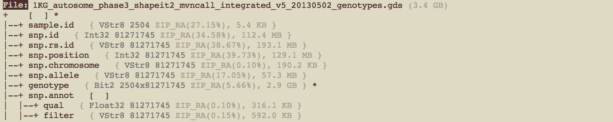

# Introduction

The package gdsfmt provides a high-level R interface to CoreArray Genomic Data Structure (GDS) data files, which are portable across platforms and include hierarchical structure to store multiple scalable array-oriented data sets with metadata information. It is suited for large-scale datasets, especially for data which are much larger than the available random-access memory. The package [gdsfmt](http://www.bioconductor.org/packages/release/bioc/html/gdsfmt.html) offers the efficient operations specifically designed for integers with less than 8 bits, since a single genetic/genomic variant, like single-nucleotide polymorphism (SNP), usually occupies fewer bits than a byte. Data compression and decompression are also supported with relatively efficient random access.


# Installation of the package gdsfmt

To install the package [gdsfmt](http://www.bioconductor.org/packages/release/bioc/html/gdsfmt.html), you need a current version (>=2.14.0) of [R](http://www.r-project.org). After installing R you can run the following commands from the R command shell to install the package [gdsfmt](http://www.bioconductor.org/packages/release/bioc/html/gdsfmt.html).

Install the package from Bioconductor repository:
```{r eval=FALSE}
if (!requireNamespace("BiocManager", quietly=TRUE))
    install.packages("BiocManager")
BiocManager::install("gdsfmt")
```

Install the development version from Github (for developers/testers only):
```{r eval=FALSE}
library("devtools")
install_github("zhengxwen/gdsfmt")
```
The `install_github()` approach requires that you build from source, i.e. `make` and compilers must be installed on your system -- see the [R FAQ](http://cran.r-project.org/faqs.html) for your operating system; you may also need to install dependencies manually.


# High-level R functions

## Creating a GDS file and variable hierarchy

An empty GDS file can be created by `createfn.gds()`:
```{r}
library(gdsfmt)
gfile <- createfn.gds("test.gds")
```

```{r echo=FALSE}
set.seed(1000)
```

Now, a file handle associated with "test.gds" is saved in the R variable *gfile*.

The GDS file can contain a hierarchical structure to store multiple GDS variables (or GDS nodes) in the file, and various data types are allowed (see the document of `add.gdsn()`) including integer, floating-point number and character.

```{r}
add.gdsn(gfile, "int", val=1:10000)
add.gdsn(gfile, "double", val=seq(1, 1000, 0.4))
add.gdsn(gfile, "character", val=c("int", "double", "logical", "factor"))
add.gdsn(gfile, "logical", val=rep(c(TRUE, FALSE, NA), 50), visible=FALSE)
add.gdsn(gfile, "factor", val=as.factor(c(NA, "AA", "CC")), visible=FALSE)
add.gdsn(gfile, "bit2", val=sample(0:3, 1000, replace=TRUE), storage="bit2")

# list and data.frame
add.gdsn(gfile, "list", val=list(X=1:10, Y=seq(1, 10, 0.25)))
add.gdsn(gfile, "data.frame", val=data.frame(X=1:19, Y=seq(1, 10, 0.5)))
```

```{r}
folder <- addfolder.gdsn(gfile, "folder")
add.gdsn(folder, "int", val=1:1000)
add.gdsn(folder, "double", val=seq(1, 100, 0.4), visible=FALSE)
```

Users can display the file content by typing `gfile` or `print(gfile)`:

```{r}
gfile
```

`print(gfile, ...)` has an argument *all* to control the display of file content. By default, *all=FALSE*; if *all=TRUE*, to show all contents in the file including hidden variables or folders. The GDS variables *logical*, *factor* and *folder/double* are hidden.

```{r}
print(gfile, all=TRUE)
```

The asterisk indicates attributes attached to a GDS variable. The attributes can be used in the R environment to interpret the variable as *logical*, *factor*, *data.frame* or *list*.

`index.gdsn()` can locate the GDS variable by a *path*:
```{r}
index.gdsn(gfile, "int")
index.gdsn(gfile, "list/Y")
index.gdsn(gfile, "folder/int")
```

```{r}
# close the GDS file
closefn.gds(gfile)
```


## Writing Data

Array-oriented data sets can be written to the GDS file. There are three possible ways to write data to a GDS variable.

```{r}
gfile <- createfn.gds("test.gds")
```

### R function *add.gdsn*

Users could pass an R variable to the function `add.gdsn()` directly. `show()` provides the preview of GDS variable.

```{r}
n <- add.gdsn(gfile, "I1", val=matrix(1:15, nrow=3))
show(n)
```

### R function *write.gdsn*

Users can specify the arguments *start* and *count* to write a subset of data. -1 in *count* means the size of that dimension, and the corresponding element in *start* should be 1. The values in *start* and *cound* should be in the dimension range.

```{r}
write.gdsn(n, rep(0,5), start=c(2,1), count=c(1,-1))
show(n)
``` 

### R function *append.gdsn*

Users can append new data to an existing GDS variable.

```{r}
append.gdsn(n, 16:24)
show(n)
```

### R function *assign.gdsn*

Users could call `assign.gdsn()` to replace specific values, subset or reorder the data variable.

```{r}
# initialize
n <- add.gdsn(gfile, "mat", matrix(1:48, 6))
show(n)

# substitute
assign.gdsn(n, .value=c(9:14,35:40), .substitute=NA)
show(n)

# subset
assign.gdsn(n, seldim=list(rep(c(TRUE, FALSE),3), rep(c(FALSE, TRUE),4)))
show(n)

# initialize and subset
n <- add.gdsn(gfile, "mat", matrix(1:48, 6), replace=TRUE)
assign.gdsn(n, seldim=list(c(4,2,6,NA), c(5,6,NA,2,8,NA,4)))
show(n)

# initialize and sort into descending order
n <- add.gdsn(gfile, "mat", matrix(1:48, 6), replace=TRUE)
assign.gdsn(n, seldim=list(6:1, 8:1))
show(n)
```


### Create a large-scale data set

**1)** When the size of dataset is larger than the system memory, users can not add a GDS variable via `add.gdsn()` directly. If the dimension is pre-defined, users can specify the dimension size in `add.gdsn()` to allocate data space. Then call `write.gdsn()` to write a small subset of data space.

```{r}
(n2 <- add.gdsn(gfile, "I2", storage="int", valdim=c(100, 2000)))

for (i in 1:2000)
{
    write.gdsn(n2, seq.int(100*(i-1)+1, length.out=100),
        start=c(1,i), count=c(-1,1))
}

show(n2)
```

**2)** Call `append.gdsn()` to append new data when the initial size is ZERO. If a compression algorithm is specified in `add.gdsn()` (e.g., *compress="ZIP"*), users should call `append.gdsn()` instead of `write.gdsn()`, since data has to be compressed sequentially.

```{r}
(n3 <- add.gdsn(gfile, "I3", storage="int", valdim=c(100, 0), compress="ZIP"))

for (i in 1:2000)
{
    append.gdsn(n3, seq.int(100*(i-1)+1, length.out=100))
}

readmode.gdsn(n3)  # finish writing with the compression algorithm
show(n3)
```

```{r}
# close the GDS file
closefn.gds(gfile)
```


## Reading Data

```{r}
gfile <- createfn.gds("test.gds")
add.gdsn(gfile, "I1", val=matrix(1:20, nrow=4))
add.gdsn(gfile, "I2", val=1:100)
closefn.gds(gfile)
```

`read.gdsn()` can load all data to an R variable in memory.

```{r}
gfile <- openfn.gds("test.gds")
n <- index.gdsn(gfile, "I1")

read.gdsn(n)
```

### Subset reading *read.gdsn* and *readex.gdsn*

A subset of data can be specified via the arguments *start* and *count* in the R function `read.gdsn`. Or specify a list of logical vectors in `readex.gdsn()`.

```{r}
# read a subset
read.gdsn(n, start=c(2, 2), count=c(2, 3))

read.gdsn(n, start=c(2, 2), count=c(2, 3), .value=c(6,15), .substitute=NA)
```

```{r}
# read a subset
readex.gdsn(n, list(c(FALSE,TRUE,TRUE,FALSE), c(TRUE,FALSE,TRUE,FALSE,TRUE)))

readex.gdsn(n, list(c(1,4,3,NA), c(2,NA,3,1,3,1)))

readex.gdsn(n, list(c(1,4,3,NA), c(2,NA,3,1,3,1)), .value=NA, .substitute=-1)
```

### Apply a user-defined function marginally

A user-defined function can be applied marginally to a GDS variable via `apply.gdsn()`. *margin=1* indicates applying the function row by row, and *margin=2* for applying the function column by column.

```{r}
apply.gdsn(n, margin=1, FUN=print, as.is="none")

apply.gdsn(n, margin=2, FUN=print, as.is="none")

# close the GDS file
closefn.gds(gfile)
```


# Examples

To create a simple GDS file,
```{r}
gfile <- createfn.gds("test.gds")
n1 <- add.gdsn(gfile, "I1", val=1:100)
n2 <- add.gdsn(gfile, "I2", val=matrix(1:20, nrow=4))

gfile
```

## Output to a text file

`apply.gdsn()` can be used to export a GDS variable to a text file. If the GDS variable is a vector,
```{r}
fout <- file("text.txt", "wt")
apply.gdsn(n1, 1, FUN=cat, as.is="none", file=fout, fill=TRUE)
close(fout)

scan("text.txt")
```
The arguments *file* and *fill* are defined in the function `cat()`.

If the GDS variable is a matrix:
```{r}
fout <- file("text.txt", "wt")
apply.gdsn(n2, 1, FUN=cat, as.is="none", file=fout, fill=4194304)
close(fout)

readLines("text.txt")
```
The number 4194304 is the maximum number of columns on a line used in printing vectors.


## Transpose a matrix

`permdim.gdsn()` can be used to transpose an array by permuting its dimensions. Or `apply.gdsn()` allows that the data returned from the user-defined function *FUN* is directly written to a target GDS node *target.node*, when *as.is="gdsnode"* and *target.node* are both given. Little *c* in R is a generic function which combines its arguments, and it passes all data to the target GDS node in the following code:

```{r}
n.t <- add.gdsn(gfile, "transpose", storage="int", valdim=c(5,0))

# apply the function over rows of matrix
apply.gdsn(n2, margin=1, FUN=c, as.is="gdsnode", target.node=n.t)

# matrix transpose
read.gdsn(n.t)

# close the GDS file
closefn.gds(gfile)
```


## Floating-point number vs. packed real number

In computing, floating point is a method of representing an approximation of a real number in a way that can support a trade-off between range and precision, which can be represented exactly is of the following form "*significand* $\times$ 2^*exponent*^". A packed real number in GDS format is defined as "*int* $\times$ scale $+$ offset", where *int* can be a 8-bit, 16-bit or 32-bit signed interger. In some cases, the strategy of packed real numbers can significantly improve the compression ratio for real numbers.

```{r}
set.seed(1000)
val <- sample(seq(0,1,0.001), 50000, replace=TRUE)
head(val)

gfile <- createfn.gds("test.gds")

add.gdsn(gfile, "N1", val=val)
add.gdsn(gfile, "N2", val=val, compress="ZIP", closezip=TRUE)
add.gdsn(gfile, "N3", val=val, storage="float")
add.gdsn(gfile, "N4", val=val, storage="float", compress="ZIP", closezip=TRUE)
add.gdsn(gfile, "N5", val=val, storage="packedreal16", scale=0.001, offset=0)
add.gdsn(gfile, "N6", val=val, storage="packedreal16", scale=0.001, offset=0, compress="ZIP", closezip=TRUE)

gfile
```

```{r echo=FALSE}
KB <- function(i)
{
    s <- objdesp.gdsn(index.gdsn(gfile, paste("N", i, sep="")))$size
    sprintf("%.1f KB", s/1000)
}

Ratio <- function(i)
{
    s <- objdesp.gdsn(index.gdsn(gfile, paste("N", i, sep="")))$size
    r <- 100*s / (8*length(val))
    sprintf("%.1f%%", r)
}

Epsilon <- function(i)
{
    ans <- mean(abs(val - read.gdsn(index.gdsn(gfile, paste0("N",i)))))
    sprintf("%0.3g", ans)
}
```

| Variable | Type | Compression Method | Size | Ratio | Machine epsilon^1^ |
|:---------|:-----|:------------------:|-----:|------:|----------------:|
| **N1** | 64-bit floating-point number | ---  |  `r KB(1)` | `r Ratio(1)` | `r Epsilon(1)` |
| **N2** | 64-bit floating-point number | zlib |  `r KB(2)` | `r Ratio(2)` | `r Epsilon(2)` |
| **N3** | 32-bit floating-point number | ---  |  `r KB(3)` | `r Ratio(3)` | `r Epsilon(3)` |
| **N4** | 32-bit floating-point number | zlib |  `r KB(4)` | `r Ratio(4)` | `r Epsilon(4)` |
| **N5** | 16-bit packed real number    | ---  |  `r KB(5)` | `r Ratio(5)` | `r Epsilon(5)` |
| **N6** | 16-bit packed real number    | zlib |  `r KB(6)` | `r Ratio(6)` | `r Epsilon(6)` |

^1^: the relative error due to rounding in floating point arithmetic.

```{r}
# close the GDS file
closefn.gds(gfile)
```


## Limited random-access of compressed data

* 10,000,000 random 0,1 sequence of 32-bit integers
    * in each 32 bits, one bit stores random 0,1 and others are ZERO
    * lower bound of compression percentage is 1/32 = 3.125%
* Testing:
    * of 10,000 random positions, read a 32-bit integer
    * compression ratio is maximized for each method
    * compression method: none, ZIP, ZIP_ra, LZ4, LZ4_ra, LZMA, LZMA_ra
    * ZIP_ra, LZ4_ra and LZMA_ra: data stored in the file are composed of multiple independent compressed blocks

```{r eval=FALSE}
set.seed(100)
# 10,000,000 random 0,1 sequence of 32-bit integers
val <- sample.int(2, 10*1000*1000, replace=TRUE) - 1L
table(val)
```
```
## val
##       0       1 
## 4999138 5000862
```
```{r eval=FALSE}
# cteate a GDS file
f <- createfn.gds("test.gds")

# compression algorithms (LZMA_ra:32K is the lower bound of LZMA_ra)
compression <- c("", "ZIP.max", "ZIP_ra.max:16K", "LZ4.max", "LZ4_ra.max:16K", "LZMA", "LZMA_ra:32K")

# save
for (i in 1:length(compression))
	print(add.gdsn(f, paste0("I", i), val=val, compress=compression[i], closezip=TRUE))

# close the file
closefn.gds(f)

cleanup.gds("test.gds")
```

* System configuration:
    * MacBook Pro, Retina, 13-inch, Late 2013, 2.8 GHz Intel Core i7, 16 GB 1600 MHz DDR3
    * R 3.2.4

```{r eval=FALSE}
# open the GDS file
f <- openfn.gds("test.gds")

# 10,000 random positions
set.seed(1000)
idx <- sample.int(length(val), 10000)

# enumerate each compression method
dat <- vector("list", length(compression))
for (i in seq_len(length(compression)))
{
	cat("Compression:", compression[i], "\n")
	n <- index.gdsn(f, paste0("I", i))
	print(system.time({
		dat[[i]] <- sapply(idx, FUN=function(k) read.gdsn(n, start=k, count=1L))
	}))
}

# check
for (i in seq_len(length(compression)))
	stopifnot(identical(dat[[i]], dat[[1L]]))

# close the file
closefn.gds(f)
```

| Compression Method    | Raw  | ZIP    | ZIP_ra | LZ4   | LZ4_ra | LZMA  | LZMA_ra |
|:----------------------|:-----|:-------|:-------|:------|:-------|:------|:--------|
| Data Size (MB)        | 38.1 | 1.9    | 2.1    | 2.8   | 2.9    | 1.4   | 1.4     |
| Compression Percent   | 100% | 5.08%  | 5.42%  | 7.39% | 7.60%  | 3.65% | 3.78%   |
| Reading Time (second) | 0.21 | 202.64 | 2.97   | 84.43 | 0.84   | 462.1 | 29.7    |


## Sparse Matrix

Sparse array is supported in gdsfmt since v1.24.0. Only non-zero values and indicies are stored in a GDS file, and reading a gds node of sparse matrix returns a `dgCMatrix` object defined in the package [Matrix](https://cran.r-project.org/web/packages/Matrix/index.html).

```{r}
# create a GDS file
f <- createfn.gds("test.gds")
set.seed(1000)
m <- matrix(sample(c(0:2), 56, replace=T), nrow=4)
(n <- add.gdsn(f, "sparse", m, storage="sp.int"))
# get a dgCMatrix sparse matrix (.sparse=TRUE by default)
read.gdsn(n)
# get a dense matrix
read.gdsn(n, .sparse=FALSE)
closefn.gds(f)
```


## Checksum for Data Integrity

Users can create hash function digests (e.g., md5, sha1, sha256, sha384, sha512) to verify data integrity, and md5 is the default digest algorithm. For example,

```{r}
# create a GDS file
f <- createfn.gds("test.gds")
n <- add.gdsn(f, "raw", rnorm(1115), compress="ZIP", closezip=TRUE)
digest.gdsn(n, action="add")
print(f, attribute=TRUE)
closefn.gds(f)
```

Reopen the file and verify data integrity:

```{r}
f <- openfn.gds("test.gds")
n <- index.gdsn(f, "raw")

get.attr.gdsn(n)$md5
digest.gdsn(n, action="verify")  # NA indicates "not applicable"

closefn.gds(f)
```


# Stylish Terminal Output in R

If the R package [crayon](http://cran.r-project.org/package=crayon) is installed in the R environment, `print()` can display the context of GDS file with different colours. For example, on MacOS,


Users can disable crayon terminal output by `options(gds.crayon=FALSE)`,
```
File: 1KG_autosome_phase3_shapeit2_mvncall_integrated_v5_20130502_genotypes.gds (3.4G)
+    [  ] *
|--+ sample.id   { VStr8 2504 ZIP_ra(27.15%), 5.4K }
|--+ snp.id   { Int32 81271745 ZIP_ra(34.58%), 112.4M }
|--+ snp.rs.id   { VStr8 81271745 ZIP_ra(38.67%), 193.1M }
|--+ snp.position   { Int32 81271745 ZIP_ra(39.73%), 129.1M }
|--+ snp.chromosome   { VStr8 81271745 ZIP_ra(0.10%), 190.2K }
|--+ snp.allele   { VStr8 81271745 ZIP_ra(17.05%), 57.3M }
|--+ genotype   { Bit2 2504x81271745 ZIP_ra(5.66%), 2.9G } *
\--+ snp.annot   [  ]
   |--+ qual   { Float32 81271745 ZIP_ra(0.10%), 316.1K }
   \--+ filter   { VStr8 81271745 ZIP_ra(0.15%), 592.0K }
```


# Session Information

```{r}
sessionInfo()
```

```{r echo=FALSE}
unlink(c("test.gds", "text.txt"), force=TRUE)
```
